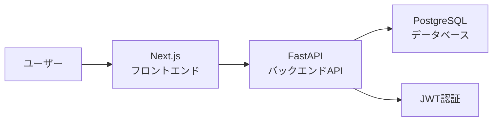

# 学習進捗管理アプリ

Section 7 チーム開発用のプロジェクトです。  
オンラインスクールの学習者が、日報や学習進捗を記録・確認できるアプリを開発します。

## 企画

### Issue

- 誰の課題？：オンラインスクールで学習している受講生、進捗を確認する講師
- なにに困っている？：DiscordやGoogleフォームで日報・進捗を共有していると、過去の投稿を見返しにくい
- 本来はどうあるべき？：自分の学習履歴を一覧で確認でき、必要に応じて編集・削除できる
- 既存のソリューションは？：Discord、Googleフォーム、スプレッドシート、Notionなど
- その課題が解決されたらいくら払う？：MVP段階では未定

### Solution

- どうやって解決する？：ログイン後、自分の日報・学習進捗を作成・一覧表示・編集・削除できるアプリを作る
- 実現できたら実際に解決できる？：自分の投稿を一覧で見返せるため、学習状況を振り返りやすくなる
- 優位性は？：学習進捗に特化し、投稿・確認・編集の流れをシンプルにできる
- デメリットや副作用はある？：認証・認可やデータ管理の実装が必要になる
- デメリットと天秤にかけてもこのソリューションを使うべき？：Yes

## MVP

MVPでは、`student` と `teacher` のroleを分け、利用できる機能を分離します。

### MVPで実装する機能

#### 共通

- ログイン
- ログイン中ユーザー情報取得
- ログアウト

**student**

- 自分の投稿一覧表示
- 投稿の新規作成
- 投稿の詳細表示
- 自分の投稿の編集
- 自分の投稿の削除

**teacher**

- 生徒全員分の投稿一覧表示
- 生徒全員分の投稿詳細表示

### MVPで対象外とする機能

- 新規登録画面
- teacherによる投稿の作成・編集・削除
- 講師向けの専用管理画面
- 生徒名、投稿日、投稿種別による絞り込み
- 講師による確認ステータス管理
- 投稿種別の選択UI

## 投稿種別

投稿には `type`を持たせ、以下の投稿種別を想定します。

| type              | 内容                                                           |
| ----------------- | -------------------------------------------------------------- |
| `daily_report`    | その日の学習内容や取り組みを記録する投稿                       |
| `progress_report` | 学習の進み具合、困っていること、次にやることなどを記録する投稿 |

MVPでは `progress_report` を基本とします。
投稿種別の選択UIが未実装の場合は、`progress_report` をデフォルト値として扱います。

## role別の利用範囲

| role      | 利用できる機能                                   |
| --------- | ------------------------------------------------ |
| `student` | 自分の投稿の作成・一覧表示・詳細表示・編集・削除 |
| `teacher` | 生徒全員分の投稿の一覧表示・詳細表示             |

`teacher` はMVPでは投稿の作成・編集・削除はできません。
また、`/dashboard` は `student` / `teacher` 共通画面とし、ログイン中ユーザーのroleによって表示内容を切り替えます。

## 技術構成

| レイヤ         | 採用予定                |
| -------------- | ----------------------- |
| フロントエンド | Next.js / TypeScript    |
| バックエンド   | Python / FastAPI        |
| データベース   | PostgreSQL              |
| ORM            | SQLModelを第一候補      |
| 認証           | JWT認証                 |
| 開発環境       | Docker / Docker Compose |

## アーキテクチャ概要

MVPでは、フロントエンド・バックエンド・データベースを分けた構成にします。



### 役割分担

| 領域           | 主な役割                                 |
| -------------- | ---------------------------------------- |
| フロントエンド | 画面表示、フォーム入力、API呼び出し      |
| バックエンド   | 認証、認可、業務ロジック、APIレスポンス  |
| データベース   | ユーザー情報、投稿データ、role情報の保存 |

## ディレクトリ構成

```text
.
├── frontend/   # フロントエンドアプリケーション
├── backend/    # バックエンドアプリケーション
└── docs/       # 企画・要件・各種設計ドキュメント
```

## 開発の始め方

各アプリケーションの具体的な起動手順は、今後それぞれのREADMEに追記します。

- フロントエンド：[frontend/README.md](./frontend/README.md)
- バックエンド：[backend/README.md](./backend/README.md)

## ドキュメント

### 企画・要件

- [PRD](./docs/PRD.md)
- [要件定義](./docs/要件定義.md)

### 設計

- [技術選定](./docs/技術選定.md)
- [画面設計](./docs/画面設計.md)
- [DB設計](./docs/DB設計.md)
- [API設計](./docs/API設計.md)

### テスト

- [テスト設計書](./docs/テスト設計書.md)

### 非機能設計

- [運用設計](./docs/運用設計.md)
- [性能設計](./docs/性能設計.md)
- [ログ設計](./docs/ログ設計.md)
- [可用性設計](./docs/可用性設計.md)
- [セキュリティ設計](./docs/セキュリティ設計.md)

### 会議メモ・検討資料

- [企画案だし](./docs/context/meeting/企画案だし.md)
- [MVP設計メモ](./docs/context/meeting/TeamC_MVP_design.md)

## コントリビュート

### 基本方針

- 作業前に最新の `main` を取得する
- 機能ごとにブランチを作成する
- 変更後はPull Requestを作成する
- Pull Requestでは、変更内容・確認したこと・相談したいことを記載する
- レビュー後に `main` へマージする

### ブランチ名の例

```text
feature/login
feature/report-crud
feature/update-docs
fix/login-error
```

### コミットメッセージの例

```text
ログイン画面を追加
API設計を整理
DB設計にreportsテーブルを追加
```

## 補足

このREADMEは、プロジェクト全体の入口として利用します。  
詳細な仕様や設計は、`docs` 配下の各ドキュメントを参照してください。
