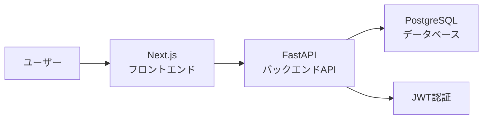

# 学習進捗管理アプリ

Section 7 チーム開発用のプロジェクトです。  
オンラインスクールの学習者が、日報や学習進捗を記録・確認できるアプリです。

## 課題と解決方法

### Issue

- 誰の課題？：オンラインスクールで学習している受講生、進捗を確認する講師
- なにに困っている？：DiscordやGoogleフォームで日報・進捗を共有していると、過去の投稿を見返しにくい
- 本来はどうあるべき？：自分の学習履歴を一覧で確認でき、必要に応じて編集・削除できる
- 既存のソリューションは？：Discord、Googleフォーム、スプレッドシート、Notionなど
- その課題が解決されたらいくら払う？：MVP段階では未定

### Solution

- どうやって解決する？：ログイン後、自分の日報・学習進捗を作成・一覧表示・編集・削除できるアプリを作る
- 実現できたら実際に解決できる？：自分の投稿を一覧で見返せるため、学習状況を振り返りやすくなる
- 優位性は？：学習進捗に特化し、投稿・確認・編集の流れをシンプルにできる
- デメリットや副作用はある？：認証・認可やデータ管理の実装が必要になる
- デメリットと天秤にかけてもこのソリューションを使うべき？：Yes

## MVP

MVPでは、`student` と `teacher` のroleを分け、利用できる機能を分離します。

### MVPで実装する機能

#### 共通

- ログイン
- ログイン中ユーザー情報取得
- ログアウト
- JWTによる認証
- 未認証ユーザーのアクセス制御

**student**

- 自分の投稿一覧表示
- 日報・進捗報告の新規作成
- 投稿詳細表示
- 自分の投稿の編集
- 自分の投稿の削除

**teacher**

- 生徒全員分の投稿一覧表示
- 生徒全員分の投稿詳細表示
- 投稿者名の確認

### MVPで対象外とする機能

- 新規登録画面
- teacherによる投稿の作成・編集・削除
- 講師向けの専用管理画面
- 生徒名、投稿日、投稿種別による絞り込み
- 講師による確認ステータス管理

## 投稿種別

投稿には `type`を持たせ、以下の2種類を扱います。

| type              | 内容                                                           |
| ----------------- | -------------------------------------------------------------- |
| `daily_report`    | その日の学習内容や取り組みを記録する投稿                       |
| `progress_report` | 学習の進み具合、困っていること、次にやることなどを記録する投稿 |

## role別の利用範囲

| role      | 利用できる機能                                   |
| --------- | ------------------------------------------------ |
| `student` | 自分の投稿の作成・一覧表示・詳細表示・編集・削除 |
| `teacher` | 生徒全員分の投稿の一覧表示・詳細表示             |

`teacher` はMVPでは投稿の作成・編集・削除はできません。

## 技術構成

| レイヤ         | 採用技術                |
| -------------- | ----------------------- |
| フロントエンド | Next.js / TypeScript    |
| バックエンド   | Python 3.13 / FastAPI   |
| データベース   | PostgreSQL 18           |
| ORM            | SQLModel                |
| 認証           | JWT                     |
| コンテナ       | Docker / Docker Compose |
| パッケージ管理 | pnpm / pip              |
| Lint / Format  | ESLint / Ruff           |

## アーキテクチャ概要

フロントエンド・バックエンド・データベースを分離した構成です。



### 役割分担

| 領域           | 主な役割                                 |
| -------------- | ---------------------------------------- |
| フロントエンド | 画面表示、フォーム入力、API呼び出し      |
| バックエンド   | 認証、認可、業務ロジック、APIレスポンス  |
| データベース   | ユーザー情報、投稿データ、role情報の保存 |

## ディレクトリ構成

```text
.
├── frontend/   # Next.js フロントエンド
├── backend/    # FastAPI バックエンド
├──docs/       # 企画・要件・各種設計ドキュメント
├── docker-compose.yml # frontend・backend・dbの構成
└── README.md
```

## Docker Composeでの起動方法

Docker Composeを使用して、以下の3サービスをまとめて起動します。

| サービス   | 使用技術   | 公開ポート |
| ---------- | ---------- | ---------- |
| `frontend` | Next.js    | `3000`     |
| `backend`  | FastAPI    | `8000`     |
| `db`       | PostgreSQL | `5433`     |

### 1. 環境変数の準備

プロジェクトルートで、バックエンド用の環境変数ファイルを作成します。

```bash
cp backend/.env.example backend/.env
```

`.env.example`の値はローカル開発用です。本番環境では使用しません。

### 2. コンテナのビルド・起動

フォアグラウンドで起動する場合：

```bash
docker compose up --build
```

バックグラウンドで起動する場合：

```bash
docker compose up --build -d
```

### 3. 起動状態の確認

```bash
docker compose ps
```

以下の3コンテナが起動していることを確認します。

- `learning-progress-frontend`
- `learning-progress-backend`
- `learning-progress-db`

DBは、接続可能な状態になると`healthy`と表示されます。

### 4. アクセス先

| 内容            | URL                             |
| --------------- | ------------------------------- |
| フロントエンド  | http://localhost:3000           |
| ログイン画面    | http://localhost:3000/login     |
| 投稿画面        | http://localhost:3000/dashboard |
| バックエンドAPI | http://localhost:8000           |
| Swagger UI      | http://localhost:8000/docs      |
| ヘルスチェック  | http://localhost:8000/health    |
| DB接続確認      | http://localhost:8000/health/db |

ルートパス`http://localhost:3000`へアクセスすると、ログイン画面へ遷移します。

### 5. DB初期化・seed投入

```bash
docker compose exec backend python -m app.db.seed
```

このコマンドにより、以下を行います。

- `users`テーブルの作成
- `reports`テーブルの作成
- 動作確認用studentユーザーの作成
- 動作確認用teacherユーザーの作成

同じメールアドレスのユーザーが存在する場合、重複作成しません。

### 6. 動作確認用ログイン情報

#### student

生徒ユーザー1

```text
email: user@example.com
password: password
```

生徒ユーザー2

```text
email: user2@example.com
password: password
```

#### teacher

講師ユーザー

```text
email: teacher@example.com
password: password
```

ローカルでの動作確認用ユーザーです。本番環境では使用しません。

### 7. 停止

```bash
docker compose down
```

DBデータを含むボリュームも削除する場合：

```bash
docker compose down -v
```

`-v`を付けると保存済みのDBデータも削除されるため、注意してください。

### 8. ログの確認

すべてのサービスのログ：

```bash
docker compose logs -f
```

サービスを指定する場合：

```bash
docker compose logs -f frontend
docker compose logs -f backend
docker compose logs -f db
```

### 9. 再ビルドが必要な変更

通常のソースコード変更は、ボリュームマウントによってコンテナへ反映されます。

以下を変更した場合は、再ビルドしてください。

- `Dockerfile`
- `docker-compose.yml`
- `package.json`
- `pnpm-lock.yaml`
- `pnpm-workspace.yaml`
- `requirements.txt`

```bash
docker compose up --build
```

フロントエンドだけをキャッシュなしで再ビルドする場合：

```bash
docker compose build frontend --no-cache
```

## 各アプリケーションの詳細

- フロントエンド：[frontend/README.md](./frontend/README.md)
- バックエンド：[backend/README.md](./backend/README.md)

## ドキュメント

### 企画・要件

- [PRD](./docs/PRD.md)
- [要件定義](./docs/要件定義.md)

### 設計

- [技術選定](./docs/技術選定.md)
- [画面設計](./docs/画面設計.md)
- [DB設計](./docs/DB設計.md)
- [API設計](./docs/API設計.md)

### テスト

- [テスト設計書](./docs/テスト設計書.md)

### 非機能設計

- [ログ設計](./docs/ログ設計.md)
- [セキュリティ設計](./docs/セキュリティ設計.md)

### 会議メモ・検討資料

- [企画案だし](./docs/context/meeting/企画案だし.md)
- [MVP設計メモ](./docs/context/meeting/TeamC_MVP_design.md)

## Git運用

### 基本方針

- 作業前に最新の `develop` を取得する
- 作業内容ごとに`develop`からブランチを作成する
- 変更後はPull Requestを作成する
- Pull Requestでは、変更内容・動作確認・相談したいことを記載する
- レビュー後に `develop` へマージする
- `main`は安定版として扱う

### ブランチ名の例

```text
feature/login
feature/report-crud
feature/update-docs
fix/login-error
```

### コミットメッセージの例

```text
feat: ログイン画面を追加
fix: 投稿取得時のエラーを修正
docs: READMEと設計書を整理
```

## 補足

このREADMEは、プロジェクト全体の入口として利用します。  
詳細な仕様や設計は、`docs` 配下の各ドキュメントを参照してください。
