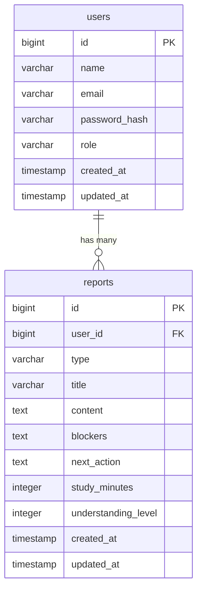

# DB 設計

> ER 図は draw.io で作成し、リポジトリ内（例：`docs/diagrams/erd.drawio`）で管理することを推奨。
>
> - draw.io: https://www.drawio.com/
> - VSCode Extension: Draw.io Integration

## 1. 設計方針

- 採用DBMS：PostgreSQL
- 命名規則
  - テーブル名：複数形
  - カラム名：snake_case
- 削除方針
  - MVPでは物理削除とする
  - 必要になった場合は、`deleted_at` を追加して論理削除を検討する
- マイグレーション運用
  - バックエンド側でマイグレーションファイルを管理する
  - テーブル変更時は、チーム内で変更内容を共有してから反映する

---

## 2. ER 図

MVPでは、主に `users` と `reports` の2テーブルで構成する。

---## 3. テーブル定義

### users

ユーザー情報を管理するテーブル。  
学生・講師などのロールもこのテーブルで管理する。

| カラム名      | 型           | NULL | デフォルト | 説明                                     |
| ------------- | ------------ | ---- | ---------- | ---------------------------------------- |
| id            | bigint       | NO   | 自動採番   | 主キー                                   |
| name          | varchar(255) | NO   |            | ユーザー名                               |
| email         | varchar(255) | NO   |            | ログインに使用するメールアドレス         |
| password_hash | varchar(255) | NO   |            | ハッシュ化したパスワード                 |
| role          | varchar(50)  | NO   | student    | ユーザー権限。`student` または `teacher` |
| created_at    | timestamp    | NO   | now()      | 作成日時                                 |
| updated_at    | timestamp    | NO   | now()      | 更新日時                                 |

---

### reports

日報・学習進捗の投稿を管理するテーブル。  
各投稿は必ず1人のユーザーに紐づく。

| カラム名            | 型           | NULL | デフォルト | 説明                             |
| ------------------- | ------------ | ---- | ---------- | -------------------------------- |
| id                  | bigint       | NO   | 自動採番   | 主キー                           |
| user_id             | bigint       | NO   |            | 投稿者のユーザーID               |
| type                | varchar(50)  | NO   | daily      | 投稿種別。例：`daily`            |
| title               | varchar(255) | NO   |            | 投稿タイトル                     |
| content             | text         | NO   |            | 学習内容・日報本文               |
| blockers            | text         | YES  |            | 困っていること・詰まっていること |
| next_action         | text         | YES  |            | 次にやること                     |
| study_minutes       | integer      | YES  |            | 学習時間（分）                   |
| understanding_level | integer      | YES  |            | 理解度。例：1〜5                 |
| created_at          | timestamp    | NO   | now()      | 作成日時                         |
| updated_at          | timestamp    | NO   | now()      | 更新日時                         |

---

## 4. インデックス・制約

### users

| 種別         | 対象カラム | 内容                                           |
| ------------ | ---------- | ---------------------------------------------- |
| 主キー       | id         | ユーザーを一意に識別する                       |
| ユニーク制約 | email      | 同じメールアドレスで複数登録できないようにする |

### reports

| 種別         | 対象カラム | 内容                                               |
| ------------ | ---------- | -------------------------------------------------- |
| 主キー       | id         | 投稿を一意に識別する                               |
| 外部キー     | user_id    | `users.id` を参照する                              |
| インデックス | user_id    | ログイン中ユーザー本人の投稿一覧取得をしやすくする |
| インデックス | created_at | 新しい投稿順で一覧表示しやすくする                 |

---

## 5. データ保持・整合性ルール

- ユーザーは一意のメールアドレスを持つ
- パスワードは平文で保存せず、ハッシュ化した値を保存する
- 投稿は必ず1人のユーザーに紐づく
- 学生ユーザーは、自分の投稿のみ取得・編集・削除できる
- 講師ユーザーは、Good to haveとして全員分の投稿を閲覧できる想定
- MVPでは投稿削除時に物理削除する
- 必要になった場合は、論理削除用の `deleted_at` カラム追加を検討する
- `study_minutes` は0以上の数値を想定する
- `understanding_level` は1〜5の範囲を想定する
