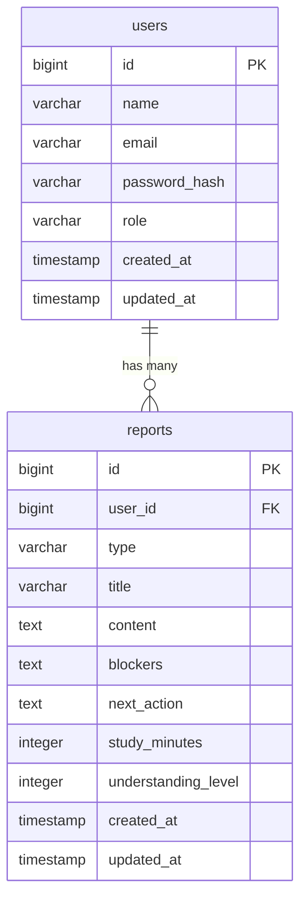

# DB 設計

> ER 図は draw.io で作成し、リポジトリ内（例：`docs/diagrams/erd.drawio`）で管理することを推奨。
>
> - draw.io: https://www.drawio.com/
> - VSCode Extension: Draw.io Integration

## 1. 設計方針

- 採用DBMS：PostgreSQL
- 命名規則
  - テーブル名：複数形
  - カラム名：snake_case
- 削除方針
  - MVPでは物理削除とする
  - 必要になった場合は、`deleted_at` を追加して論理削除を検討する
- マイグレーション運用
  - バックエンド側でマイグレーションファイルを管理する
  - テーブル変更時は、チーム内で変更内容を共有してから反映する
- ユーザー管理方針
  - MVPでは新規登録画面を実装しない
  - `student` / `teacher` ユーザーは初期データとして事前に作成する

---

## 2. ER 図

MVPでは、主に `users` と `reports` の2テーブルで構成する。



---## 3. テーブル定義

### users

ユーザー情報を管理するテーブル。  
学生・講師などのロールもこのテーブルで管理する。

| カラム名      | 型           | NULL | デフォルト | 説明                                     |
| ------------- | ------------ | ---- | ---------- | ---------------------------------------- |
| id            | bigint       | NO   | 自動採番   | 主キー                                   |
| name          | varchar(255) | NO   |            | ユーザー名                               |
| email         | varchar(255) | NO   |            | ログインに使用するメールアドレス         |
| password_hash | varchar(255) | NO   |            | ハッシュ化したパスワード                 |
| role          | varchar(50)  | NO   | student    | ユーザー権限。`student` または `teacher` |
| created_at    | timestamp    | NO   | now()      | 作成日時                                 |
| updated_at    | timestamp    | NO   | now()      | 更新日時                                 |

---

### reports

投稿を管理するテーブル。  
各投稿は必ず1人のユーザーに紐づく。
`teacher` が投稿一覧を確認する際は、`reports.user_id` をもとに `users` テーブルと結合し、投稿者名も表示できるようにする。
そのため、`reports` テーブルには投稿者名を直接保存せず、投稿者情報は `users` テーブルから取得する。

| カラム名            | 型           | NULL | デフォルト      | 説明                                              |
| ------------------- | ------------ | ---- | --------------- | ------------------------------------------------- |
| id                  | bigint       | NO   | 自動採番        | 主キー                                            |
| user_id             | bigint       | NO   |                 | 投稿者のユーザーID。 `users.id` を参照する        |
| type                | varchar(50)  | NO   | progress_report | 投稿種別。`daily_report` または `progress_report` |
| title               | varchar(255) | NO   |                 | 投稿タイトル                                      |
| content             | text         | NO   |                 | 学習内容・日報本文                                |
| blockers            | text         | YES  |                 | 困っていること・詰まっていること                  |
| next_action         | text         | YES  |                 | 次にやること                                      |
| study_minutes       | integer      | YES  |                 | 学習時間（分）                                    |
| understanding_level | integer      | YES  |                 | 理解度。例：1〜5                                  |
| created_at          | timestamp    | NO   | now()           | 作成日時                                          |
| updated_at          | timestamp    | NO   | now()           | 更新日時                                          |

---

## 4. インデックス・制約

### users

| 種別           | 対象カラム                              | 内容                                           |
| -------------- | --------------------------------------- | ---------------------------------------------- |
| 主キー         | id                                      | ユーザーを一意に識別する                       |
| ユニーク制約   | email                                   | 同じメールアドレスで複数登録できないようにする |
| 制約　｜　role | `student` または `teacher` を想定する　 |

### reports

| 種別                          | 対象カラム              | 内容                                                                         |
| ----------------------------- | ----------------------- | ---------------------------------------------------------------------------- |
| 主キー                        | id                      | 投稿を一意に識別する                                                         |
| 外部キー                      | user_id                 | `users.id` を参照する                                                        |
| インデックス                  | user_id                 | ログイン中ユーザー本人の投稿一覧取得、または投稿者情報との結合をしやすくする |
| インデックス                  | created_at              | 新しい投稿順で一覧表示しやすくする                                           |
| 制約　｜　study_minutes       | 0以上の数値を想定する　 |
| 制約　｜　understanding_level | 1〜5の範囲を想定する　  |

---

## 5. データ保持・整合性ルール

- MVPでは新規登録画面を実装しないため、`student` / `teacher` ユーザーは初期データとして事前に作成する
- ユーザーは一意のメールアドレスを持つ
- パスワードは平文で保存せず、ハッシュ化した値を保存する
- role は `student` または `teacher` とする
- 投稿は必ず1人のユーザーに紐づく
- 投稿には `type` を持たせ、`daily_report` または `progress_report` を管理できるようにする
- MVPでは `progress_report` を基本とし、投稿種別の切り替えUIは実装できる範囲で対応する
- 投稿種別の選択UIが未実装の場合は、`progress_report` をデフォルト値として扱う
- `student`は、自分の投稿のみ取得・編集・削除できる
- `teacher`は、生徒全員分の投稿を閲覧できる
- `teacher` が生徒全員分の投稿を閲覧する際は、`reports.user_id` をもとに `users.name` を取得し、投稿者名を表示できるようにする
- `reports` テーブルには投稿者名を直接保存せず、投稿者名は `users` テーブルから取得する
- MVPでは、`teacher` や管理者による投稿の作成・編集・削除は対象外とする
- MVPでは投稿削除時に物理削除する
- 必要になった場合は、論理削除用の `deleted_at` カラム追加を検討する
- `study_minutes` は0以上の数値を想定する
- `understanding_level` は1〜5の範囲を想定する
- `updated_at` は投稿編集時に現在日時へ更新する

---

## 6. teacher向け一覧表示時のデータ取得方針

`teacher` が生徒全員分の投稿一覧を確認する場合、`reports` テーブルと `users` テーブルを結合して、投稿データと投稿者名を取得する。

例：

```sql
SELECT
  reports.id,
  reports.user_id,
  users.name AS user_name,
  reports.type,
  reports.title,
  reports.content,
  reports.blockers,
  reports.next_action,
  reports.study_minutes,
  reports.understanding_level,
  reports.created_at,
  reports.updated_at
FROM reports
JOIN users ON reports.user_id = users.id
ORDER BY reports.created_at DESC;
```

APIレスポンスでは、必要に応じて `user_id` と `user_name` を含める。

例：

```json
{
  "id": 1,
  "user_id": 2,
  "user_name": "山田 花子",
  "type": "progress_report",
  "title": "FastAPIの学習",
  "content": "JWT認証について学習した",
  "blockers": "DB接続がまだ不安",
  "next_action": "usersテーブルとの接続を確認する",
  "study_minutes": 90,
  "understanding_level": 3,
  "created_at": "2026-06-09T10:00:00",
  "updated_at": "2026-06-09T10:00:00"
}
```
