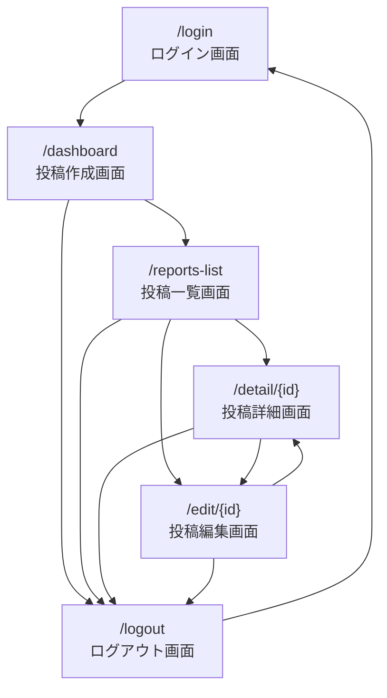
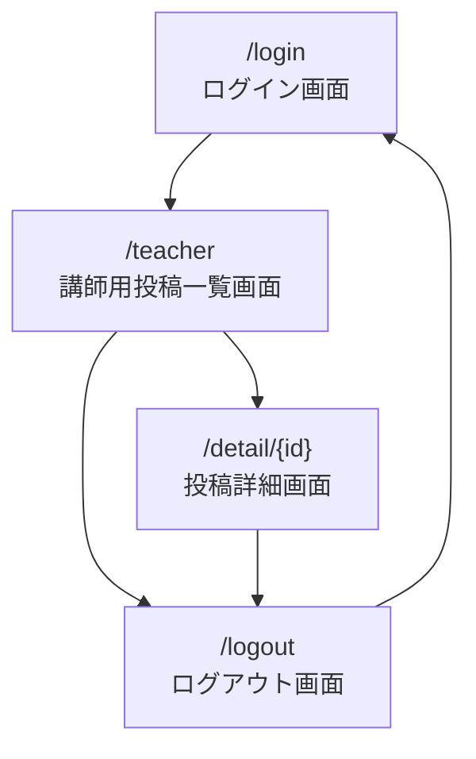

# 画面設計

## 1. 設計方針

- ターゲットデバイス：PCを優先する
- スマートフォン対応は、MVP完了後に必要に応じて調整する
- フロントエンドはNext.jsとTypeScriptで実装する
- 入力フォームは、必須項目・エラー表示が分かりやすい設計にする
- 認証が必要な画面では、未ログインユーザーをログイン画面へ遷移させる
- 不正または期限切れのJWTを検出した場合は、認証情報を削除してログイン画面へ遷移させる
- `student` / `teacher` で利用できる画面と操作を分離する
- 権限制御はフロントエンドの表示制御だけでなく、バックエンドAPIでも行う
- 投稿種別は、`daily_report`または`progress_report`から選択できる
- `student`は自分の投稿のみ作成・取得・編集・削除できる
- `teacher` は生徒全員分の投稿を一覧・詳細表示できるが、投稿の作成・編集・削除はできない
- API通信中は必要に応じてローディング表示を行う
- APIエラー時は、画面を停止させずエラーメッセージを表示する
- 削除操作では確認ダイアログを表示する

---

## 2. 画面遷移図

### student

### teacher

---

# 画面設計

## 1. 設計方針

- ターゲットデバイスはPCを優先する
- スマートフォン対応は、MVP完了後に必要に応じて調整する
- フロントエンドはNext.jsとTypeScriptで実装する
- 認証が必要な画面では、未ログインユーザーをログイン画面へ遷移させる
- 不正または期限切れのJWTを検出した場合は、認証情報を削除してログイン画面へ遷移させる
- `student`と`teacher`で利用できる画面と操作を分離する
- 権限制御はフロントエンドの表示制御だけでなく、バックエンドAPIでも行う
- 投稿種別は、`daily_report`または`progress_report`から選択できる
- `student`は自分の投稿のみ作成・取得・編集・削除できる
- `teacher`は生徒全員分の投稿を一覧・詳細表示できる
- `teacher`による投稿の作成・編集・削除はMVP対象外とする
- API通信中は必要に応じてローディング表示を行う
- APIエラー時は、画面を停止させずエラーメッセージを表示する
- 削除操作では確認ダイアログを表示する

---

## 2. 画面遷移図

### student

### teacher

---

## 3. 画面一覧

| 画面ID | パス           | 画面名             | 対象role          | 役割                                                  | 関連API                                  |
| ------ | -------------- | ------------------ | ----------------- | ----------------------------------------------------- | ---------------------------------------- |
| UI-001 | `/login`       | ログイン画面       | 共通              | メールアドレスとパスワードでログインする              | `POST /auth/login`                       |
| UI-002 | `/dashboard`   | 投稿作成画面       | student           | 日報または進捗報告を作成する                          | `POST /reports`                          |
| UI-003 | `/report-list` | 投稿一覧画面       | student           | 自分の投稿を一覧表示する                              | `GET /reports`、`DELETE /reports/{id}`   |
| UI-004 | `/detail/{id}` | 投稿詳細画面       | student / teacher | 指定した投稿の詳細を表示する                          | `GET /reports/{id}`                      |
| UI-005 | `/edit/{id}`   | 投稿編集画面       | student           | 自分の投稿を編集する                                  | `GET /reports/{id}`、`PUT /reports/{id}` |
| UI-006 | `/teacher`     | 講師用投稿一覧画面 | teacher           | 生徒全員分の投稿を一覧表示する                        | `GET /reports`                           |
| UI-007 | `/logout`      | ログアウト画面     | 共通              | JWTを削除して認証状態を解除し、ログイン画面へ遷移する | なし                                     |

---

## 4. 各画面の仕様

### UI-001：ログイン画面

#### 目的

ユーザーがメールアドレスとパスワードを入力し、認証を行う。

#### 入力項目

| 項目           | 必須 | 内容                             |
| -------------- | ---- | -------------------------------- |
| メールアドレス | 必須 | ログインに使用するメールアドレス |
| パスワード     | 必須 | ログインに使用するパスワード     |

#### 動作

- ログイン成功時にJWTを取得する
- JWTをフロントエンド側で保持する
- ログイン中ユーザー情報を取得する
- roleに応じた画面へ遷移する
  - `student`：`/dashboard`
  - `teacher`：`/teacher`
- ログイン失敗時はエラーメッセージを表示する

---

### UI-002：投稿作成画面

#### 目的

studentが日報または進捗報告を作成する。

#### 主な表示・入力項目

| 項目         | 必須 | 内容                                                                 |
| ------------ | ---- | -------------------------------------------------------------------- |
| 投稿種別     | 必須 | 日報または進捗報告を選択する                                         |
| タイトル     | 任意 | 未入力の場合は、投稿種別に応じて「日報」または「進捗報告」を設定する |
| 本文         | 必須 | 学習内容や進捗を入力する                                             |
| 困りごと     | 任意 | 現在困っていることを入力する                                         |
| 次にやること | 任意 | 次の行動を入力する                                                   |
| 学習時間     | 任意 | 0以上の数値を入力する                                                |
| 理解度       | 任意 | 1〜5の範囲で入力する                                                 |

#### 動作

- 日報と進捗報告を切り替えられる
- 必須項目が未入力の場合は投稿できない
- 投稿時に`POST /reports`を実行する
- 投稿者IDは画面から送らず、バックエンドがJWTから取得する
- 投稿成功後は投稿一覧画面へ遷移する
- 入力を消去する操作を提供する
- 投稿一覧画面へ移動する導線を表示する

---

### UI-003：投稿一覧画面

#### 目的

studentが自分の投稿を一覧で確認する。

#### 表示内容

- 日報
- 進捗報告
- 投稿タイトル
- 投稿本文
- 作成日時
- 投稿種別
- 月ごとの投稿グループ

#### 動作

- `GET /reports`でログイン中student本人の投稿を取得する
- 日報と進捗報告を分類して表示する
- 月単位の一覧を開閉できる
- 投稿詳細画面へ遷移できる
- 投稿編集画面へ遷移できる
- 投稿を削除できる
- 削除前に確認ダイアログを表示する
- 削除後は一覧から対象投稿を除外する
- 再読み込み時はAPIから投稿一覧を再取得する

---

### UI-004：投稿詳細画面

#### 目的

指定した投稿の内容を確認する。

#### 表示内容

- 投稿種別
- タイトル
- 本文
- 困りごと
- 次にやること
- 学習時間
- 理解度
- 作成日時
- 更新日時
- 投稿者名

表示する値がない任意項目は、非表示または空の状態として扱う。

#### 動作

- `GET /reports/{id}`で投稿を取得する
- studentは自分の投稿のみ閲覧できる
- teacherは生徒全員分の投稿を閲覧できる
- studentには編集画面への導線を表示する
- 投稿が存在しない、または取得できない場合はエラーメッセージを表示する
- 一覧画面へ戻る導線を表示する

---

### UI-005：投稿編集画面

#### 目的

studentが自分の投稿を編集する。

#### 動作

- `GET /reports/{id}`で既存の投稿内容を取得する
- 取得した内容を編集フォームの初期値として表示する
- 保存時に`PUT /reports/{id}`を実行する
- studentは自分の投稿のみ編集できる
- teacherは編集できない
- 保存成功後は詳細画面または一覧画面へ遷移する
- 取得失敗時はエラーメッセージを表示する

#### 既知の課題

存在しない投稿IDへアクセスした場合、取得エラーと空の編集フォームが同時に表示される。
今後、取得失敗時は編集フォームと保存ボタンを非表示にする。

---

### UI-006：講師用投稿一覧画面

#### 目的

teacherが生徒全員分の投稿を確認する。

#### 表示内容

- 生徒全員分の投稿
- 投稿者名
- 投稿種別
- タイトル
- 本文
- 作成日時

#### 動作

- `GET /reports`で生徒全員分の投稿を取得する
- 投稿者を識別できるように投稿者名を表示する
- 投稿詳細画面へ遷移できる
- 投稿作成・編集・削除操作は提供しない
- API側でもteacherによる作成・編集・削除を拒否する

---

### UI-007：ログアウト画面

#### 目的

ログイン中ユーザーの認証状態を解除する。

#### 動作

- フロントエンド側で保持しているJWTを削除する
- ログイン中ユーザー情報を削除する
- ログイン画面へ遷移する
- ログアウト後は認証が必要な画面へアクセスできない

---

## 5. コンポーネント設計

実装では、共通処理や再利用可能なUIを必要に応じてコンポーネントへ分離する。

### 共通コンポーネント

| コンポーネント・機能 | 役割                                                 |
| -------------------- | ---------------------------------------------------- |
| `ProtectedRoute`     | 未認証ユーザーによる保護画面へのアクセスを制御する   |
| `AuthProvider`       | 認証状態、ログイン中ユーザー、認証復元を管理する     |
| `LogoutButton`       | ログアウト画面への遷移またはログアウト操作を提供する |
| `WoodenTitle`        | 投稿関連画面で共通して使用するタイトル表示           |
| APIクライアント      | JWTの付与、API URL、共通エラー処理を管理する         |
| 投稿APIモジュール    | 投稿の取得・作成・更新・削除処理をまとめる           |

コンポーネント名や配置は、実際のディレクトリ構成に合わせる。

---

## 6. バリデーション・エラー表示

### ログイン画面

| 入力項目       | バリデーション   | エラー表示                   |
| -------------- | ---------------- | ---------------------------- |
| メールアドレス | 必須、メール形式 | 入力欄付近またはフォーム上部 |
| パスワード     | 必須             | 入力欄付近またはフォーム上部 |

### 投稿作成 / 編集画面

| 入力項目 | バリデーション                          | エラー表示・処理                         |
| -------- | --------------------------------------- | ---------------------------------------- |
| 投稿種別 | `daily_report` または `progress_report` | 不正な値は送信しない                     |
| タイトル | 必須、255文字以内                       | 未入力時は投稿種別に応じたタイトルを設定 |
| 本文     | 必須                                    | 未入力時は投稿できない                   |
| 困りごと | 任意                                    | なし                                     |
| 次の行動 | 任意                                    | なし                                     |
| 学習時間 | 任意、0以上の数値                       | 不正な場合は送信しない                   |
| 理解度   | 任意、1〜5の範囲                        | 不正な場合は送信しない                   |

### APIエラー表示

| エラー内容        | 表示・遷移方針                             |
| ----------------- | ------------------------------------------ |
| ログイン失敗      | ログイン画面へエラーメッセージを表示する   |
| 未ログイン        | ログイン画面へ遷移する                     |
| 不正・期限切れJWT | JWTを削除し、ログイン画面へ遷移する        |
| 権限なし          | 操作できないことを示すメッセージを表示する |
| 投稿一覧取得失敗  | 一覧画面にエラーメッセージを表示する       |
| 投稿詳細取得失敗  | 詳細画面にエラーメッセージを表示する       |
| 投稿保存失敗      | 作成・編集画面にエラーメッセージを表示する |
| 投稿削除失敗      | 一覧画面にエラーメッセージを表示する       |

### 共通方針

- エラーが発生しても画面全体を白画面にしない
- エラーメッセージは、ユーザーが次に何をすればよいか分かる文言にする
- 投稿保存失敗時は、可能な限り入力済みの内容を保持する
- データ取得中はローディング表示を出す
- 削除操作は、誤操作を防ぐため確認ダイアログを表示する
- teacherが作成・編集・削除画面に直接アクセスした場合は、権限エラーを表示する、または一覧画面へ戻す
- API通信中は二重送信を防止する

---

## 7. role別表示・操作ルール

| role    | パス           | 表示・操作                               |
| ------- | -------------- | ---------------------------------------- |
| student | `/dashboard`   | 投稿作成                                 |
| student | `/report-list` | 自分の投稿一覧、詳細・編集・削除への導線 |
| student | `/detail/{id}` | 自分の投稿詳細、編集への導線             |
| student | `/edit/{id}`   | 自分の投稿編集                           |
| student | `/teacher`     | アクセス不可                             |
| teacher | `/teacher`     | 生徒全員分の投稿一覧                     |
| teacher | `/detail/{id}` | 生徒の投稿詳細                           |
| teacher | `/dashboard`   | 投稿作成不可                             |
| teacher | `/edit/{id}`   | アクセス不可                             |
| 共通    | `/logout`      | 認証情報を削除してログイン画面へ遷移     |

---

## 8. 不正アクセス時の表示・遷移

| ケース                          | 表示・遷移                                       |
| ------------------------------- | ------------------------------------------------ |
| 未ログインで保護画面へアクセス  | `/login`へ遷移する                               |
| 不正なJWTで保護画面へアクセス   | JWTを削除し、`/login`へ遷移する                  |
| teacherが投稿作成画面へアクセス | アクセスを拒否し、講師用一覧画面へ戻す           |
| teacherが投稿編集画面へアクセス | アクセスを拒否し、講師用一覧画面へ戻す           |
| studentがteacher画面へアクセス  | アクセスを拒否し、student用画面へ戻す            |
| studentが他人の投稿へアクセス   | API側で拒否し、エラーメッセージを表示する        |
| 存在しない投稿IDへアクセス      | 投稿取得エラーを表示し、一覧へ戻る導線を表示する |

---

## 9. セキュリティ上の注意点

- 画面上でボタンを非表示にするだけでなく、バックエンドAPIでも認可を確認する
- フロントエンドから送信された`userId`を信用しない
- 投稿者IDはJWTから取得する
- JWTを画面やログへ出力しない
- パスワードやパスワードハッシュをAPIレスポンスへ含めない
- ユーザー入力をHTMLとして直接埋め込まない
- `dangerouslySetInnerHTML`は原則使用しない
