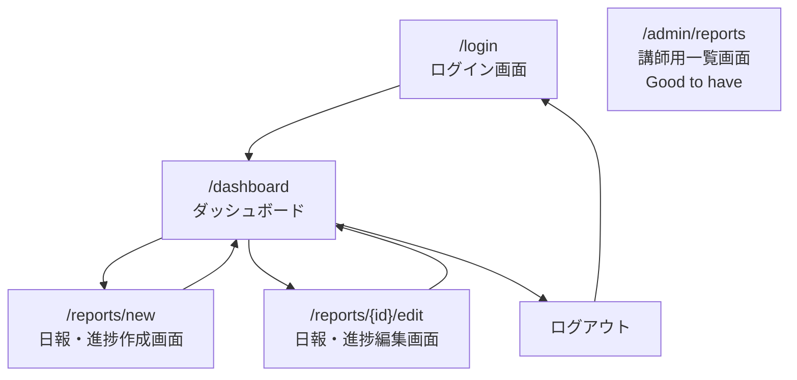

# 画面設計

## 1. 設計方針

- ターゲットデバイス：PCを優先する
- スマートフォン対応は、MVP完了後に必要に応じて調整する
- UIライブラリはMVP時点では未定
- まずはNext.jsで基本的な画面構成を作成する
- 入力フォームは、必須項目・エラー表示が分かりやすい設計にする
- 認証が必要な画面では、未ログイン時にログイン画面へ誘導する

---

## 2. 画面遷移図

MVPでは、以下の画面遷移を想定する。

---

## 3. 画面一覧

| 画面 ID | パス               | 画面名             | 役割                               | 主な入出力                                           | 関連 API                             |
| ------- | ------------------ | ------------------ | ---------------------------------- | ---------------------------------------------------- | ------------------------------------ |
| UI-001  | /login             | ログイン画面       | ユーザーがログインする             | メールアドレス、パスワード                           | POST /auth/login                     |
| UI-002  | /dashboard         | ダッシュボード     | 自分の日報・進捗投稿一覧を確認する | 投稿一覧、作成ボタン、編集ボタン、削除ボタン         | GET /reports, DELETE /reports/{id}   |
| UI-003  | /reports/new       | 日報・進捗作成画面 | 新しい日報・進捗投稿を作成する     | タイトル、本文、困りごと、次の行動、学習時間、理解度 | POST /reports                        |
| UI-004  | /reports/{id}/edit | 日報・進捗編集画面 | 既存の日報・進捗投稿を編集する     | 投稿詳細、編集フォーム                               | GET /reports/{id}, PUT /reports/{id} |
| UI-005  | /admin/reports     | 講師用一覧画面     | 全員分の日報・進捗投稿を確認する   | 全ユーザーの投稿一覧                                 | GET /admin/reports                   |

---

## 4. コンポーネント設計

### 共通コンポーネント

| コンポーネント名 | 役割                                   | 使用画面                 |
| ---------------- | -------------------------------------- | ------------------------ |
| Header           | 画面上部のナビゲーションを表示する     | ログイン後の各画面       |
| LoginForm        | メールアドレス・パスワード入力フォーム | ログイン画面             |
| ReportCard       | 日報・進捗投稿の概要を表示する         | ダッシュボード           |
| ReportForm       | 日報・進捗投稿の作成・編集フォーム     | 作成画面、編集画面       |
| ErrorMessage     | 入力エラーやAPIエラーを表示する        | 各フォーム画面           |
| Loading          | データ取得中の表示                     | ダッシュボード、編集画面 |
| Button           | 送信、編集、削除などの操作ボタン       | 各画面                   |

### 画面ごとのコンポーネント構成

#### ログイン画面

- LoginForm
- ErrorMessage

#### ダッシュボード

- Header
- ReportCard
- Loading
- ErrorMessage
- Button

#### 日報・進捗作成画面

- Header
- ReportForm
- ErrorMessage
- Button

#### 日報・進捗編集画面

- Header
- ReportForm
- Loading
- ErrorMessage
- Button

#### 講師用一覧画面（Good to have）

- Header
- ReportCard
- Loading
- ErrorMessage

---

## 5. バリデーション・エラー表示

### ログイン画面

| 入力項目       | バリデーション   | エラー表示       |
| -------------- | ---------------- | ---------------- |
| メールアドレス | 必須、メール形式 | 入力欄の下に表示 |
| パスワード     | 必須             | 入力欄の下に表示 |

### 日報・進捗作成 / 編集画面

| 入力項目 | バリデーション    | エラー表示       |
| -------- | ----------------- | ---------------- |
| タイトル | 必須、255文字以内 | 入力欄の下に表示 |
| 本文     | 必須              | 入力欄の下に表示 |
| 困りごと | 任意              | なし             |
| 次の行動 | 任意              | なし             |
| 学習時間 | 任意、0以上の数値 | 入力欄の下に表示 |
| 理解度   | 任意、1〜5の範囲  | 入力欄の下に表示 |

### APIエラー表示

| エラー内容   | 表示方針                                       |
| ------------ | ---------------------------------------------- |
| ログイン失敗 | ログインフォーム上部、または入力欄の近くに表示 |
| 未ログイン   | ログイン画面へ遷移する                         |
| 権限なし     | 「この操作はできません」と表示する             |
| 投稿取得失敗 | ダッシュボード上にエラーメッセージを表示する   |
| 投稿保存失敗 | フォーム上部にエラーメッセージを表示する       |

### 表示方針

- エラーメッセージは、ユーザーが次に何をすればよいか分かる文言にする
- 入力内容を保存できなかった場合は、入力済みの内容をできるだけ保持する
- データ取得中はローディング表示を出す
- 削除操作は、誤操作を防ぐため確認ダイアログを表示する
