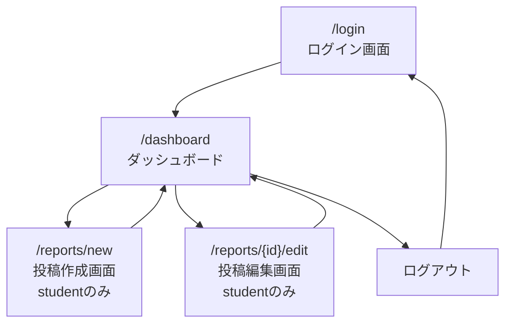

# 画面設計

## 1. 設計方針

- ターゲットデバイス：PCを優先する
- スマートフォン対応は、MVP完了後に必要に応じて調整する
- UIライブラリはMVP時点では未定
- まずはNext.jsで基本的な画面構成を作成する
- 入力フォームは、必須項目・エラー表示が分かりやすい設計にする
- 認証が必要な画面では、未ログイン時にログイン画面へ誘導する
- `/dashboard` は `student` / `teacher` 共通のログイン後画面とする
- `/dashboard` では、ログイン中ユーザーのroleによって表示内容と利用できる機能を切り替える
- MVPでは専用の講師用管理画面は作成しない
- MVPでは、`teacher` は生徒全員分の投稿を一覧・詳細表示できるが、投稿の作成・編集・削除はできない
- 投稿には `type` を持たせるが、投稿種別の選択UIは実装できる範囲で対応する
- 投稿種別の選択UIが未実装の場合は、`progress_report` をデフォルト値として扱う

---

## 2. 画面遷移図

MVPでは、以下の画面遷移を想定する。

### role別の画面表示

- `student` がログインした場合
  - `/dashboard` に自分の投稿一覧を表示する
  - 投稿作成ボタンを表示する
  - 自分の投稿に対して編集・削除ボタンを表示する
- `teacher` がログインした場合
  - /dashboard に生徒全員分の投稿一覧を表示する
  - 投稿者名を表示する
  - 投稿作成・編集・削除ボタンは表示しない

---

## 3. 画面一覧

| 画面 ID | パス               | 画面名             | 役割                                       | 主な入出力                                                     | 関連 API                             |
| ------- | ------------------ | ------------------ | ------------------------------------------ | -------------------------------------------------------------- | ------------------------------------ |
| UI-001  | /login             | ログイン画面       | ユーザーがログインする                     | メールアドレス、パスワード                                     | POST /auth/login                     |
| UI-002A | /dashboard         | 生徒ダッシュボード | `student` が自分の投稿一覧を確認する       | 自分の投稿一覧、作成ボタン、編集ボタン、削除ボタン             | GET /reports, DELETE /reports/{id}   |
| UI-002B | /dashboard         | 講師ダッシュボード | `teacher` が生徒全員分の投稿一覧を確認する | 全生徒分の投稿一覧、投稿者名                                   | GET /reports                         |
| UI-003  | /reports/new       | 投稿作成画面       | `student`が新しい投稿を作成する            | タイトル、本文、困りごと、次の行動、学習時間、理解度、投稿種別 | POST /reports                        |
| UI-004  | /reports/{id}/edit | 投稿編集画面       | `student`が自分の投稿を編集する            | 投稿詳細、編集フォーム                                         | GET /reports/{id}, PUT /reports/{id} |

> `/dashboard` は `student` / `teacher` 共通のパスとし、ログイン中ユーザーのroleによって表示内容を切り替える。

---

## 4. コンポーネント設計

### 共通コンポーネント

| コンポーネント名 | 役割                                   | 使用画面                 |
| ---------------- | -------------------------------------- | ------------------------ |
| Header           | 画面上部のナビゲーションを表示する     | ログイン後の各画面       |
| LoginForm        | メールアドレス・パスワード入力フォーム | ログイン画面             |
| ReportCard       | 投稿の概要を表示する                   | 生徒・講師ダッシュボード |
| ReportForm       | 投稿の作成・編集フォーム               | 作成画面、編集画面       |
| ErrorMessage     | 入力エラーやAPIエラーを表示する        | 各フォーム画面           |
| Loading          | データ取得中の表示                     | ダッシュボード、編集画面 |
| Button           | 送信、編集、削除などの操作ボタン       | 各画面                   |

### 画面ごとのコンポーネント構成

#### ログイン画面

- LoginForm
- ErrorMessage

#### 生徒ダッシュボード

- Header
- ReportCard
- Loading
- ErrorMessage
- Button

表示内容：

- 自分の投稿一覧
- 投稿作成ボタン
- 編集ボタン
- 削除ボタン

#### 講師ダッシュボード

- Header
- ReportCard
- Loading
- ErrorMessage

表示内容：

- 生徒全員分の投稿一覧
- 投稿者名

MVPでは表示しないもの：

- 投稿作成ボタン
- 編集ボタン
- 削除ボタン
- ステータス変更ボタン
- 絞り込み機能

#### 投稿作成画面

- Header
- ReportForm
- ErrorMessage
- Button

#### 投稿編集画面

- Header
- ReportForm
- Loading
- ErrorMessage
- Button

---

## 5. バリデーション・エラー表示

### ログイン画面

| 入力項目       | バリデーション   | エラー表示       |
| -------------- | ---------------- | ---------------- |
| メールアドレス | 必須、メール形式 | 入力欄の下に表示 |
| パスワード     | 必須             | 入力欄の下に表示 |

### 投稿作成 / 編集画面

| 入力項目 | バリデーション                                | エラー表示       |
| -------- | --------------------------------------------- | ---------------- |
| 投稿種別 | 任意。`daily_report` または `progress_report` | 入力欄の下に表示 |
| タイトル | 必須、255文字以内                             | 入力欄の下に表示 |
| 本文     | 必須                                          | 入力欄の下に表示 |
| 困りごと | 任意                                          | なし             |
| 次の行動 | 任意                                          | なし             |
| 学習時間 | 任意、0以上の数値                             | 入力欄の下に表示 |
| 理解度   | 任意、1〜5の範囲                              | 入力欄の下に表示 |

> 投稿種別の選択UIが未実装の場合は、`progress_report` をデフォルト値として送信する。

### APIエラー表示

| エラー内容   | 表示方針                                       |
| ------------ | ---------------------------------------------- |
| ログイン失敗 | ログインフォーム上部、または入力欄の近くに表示 |
| 未ログイン   | ログイン画面へ遷移する                         |
| 権限なし     | 「この操作はできません」と表示する             |
| 投稿取得失敗 | ダッシュボード上にエラーメッセージを表示する   |
| 投稿保存失敗 | フォーム上部にエラーメッセージを表示する       |
| 投稿削除失敗 | ダッシュボード上にエラーメッセージを表示する   |

### 表示方針

- エラーメッセージは、ユーザーが次に何をすればよいか分かる文言にする
- 入力内容を保存できなかった場合は、入力済みの内容をできるだけ保持する
- データ取得中はローディング表示を出す
- 削除操作は、誤操作を防ぐため確認ダイアログを表示する
- teacherが作成・編集・削除画面に直接アクセスした場合は、権限エラーを表示する、またはダッシュボードへ戻す

---

## 6. role別表示・操作ルール

| role    | 画面               | 表示内容                       | 操作可能な内容               |
| ------- | ------------------ | ------------------------------ | ---------------------------- |
| student | /dashboard         | 自分の投稿一覧                 | 投稿作成、投稿編集、投稿削除 |
| teacher | /dashboard         | 生徒全員分の投稿一覧、投稿者名 | 投稿一覧表示、投稿詳細表示   |
| student | /reports/new       | 投稿作成フォーム               | 投稿作成                     |
| teacher | /reports/new       | アクセス不可                   | なし                         |
| student | /reports/{id}/edit | 自分の投稿編集フォーム         | 投稿編集                     |
| teacher | /reports/{id}/edit | アクセス不可                   | なし                         |

### 不正アクセス時の表示・遷移

| ケース                                    | 表示・遷移                                            |
| ----------------------------------------- | ----------------------------------------------------- |
| 講師が投稿作成画面にアクセスした場合      | 404ページを表示し、ダッシュボードへ戻る導線を表示する |
| 講師が投稿編集画面にアクセスした場合      | 404ページを表示し、ダッシュボードへ戻る導線を表示する |
| 生徒が他人の投稿編集URLにアクセスした場合 | 404ページを表示し、ダッシュボードへ戻る導線を表示する |

### 注意点

- 表示上ボタンを隠すだけでなく、バックエンドAPI側でも必ず認可チェックを行う
- `student` が他人の投稿編集URLに直接アクセスした場合も、バックエンド側で拒否する
- `teacher` が投稿作成・編集・削除APIを実行した場合は、バックエンド側で拒否する
- teacher向け一覧では、誰の投稿か分かるように投稿者名を表示する
